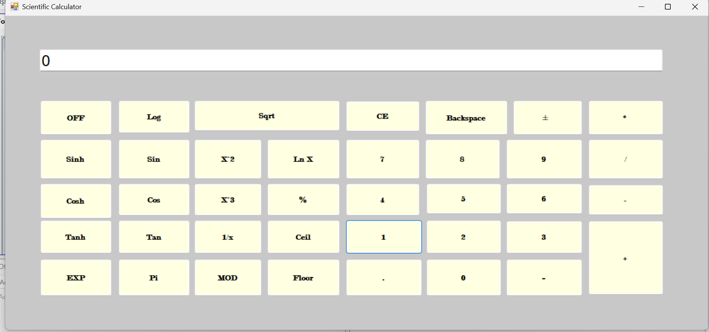

# Scientific Calculator

## Overview

Scientific Calculator is a desktop application developed in C# using the .NET platform and Visual Studio. The project provides both basic arithmetic operations and scientific calculation functionalities through a simple and user-friendly interface.

The main purpose of this project is to demonstrate object-oriented programming principles, desktop application development skills, and practical problem-solving abilities using C#.

## Features

- Basic arithmetic operations
  - Addition
  - Subtraction
  - Multiplication
  - Division

- Scientific functions
  - Power calculations
  - Square root operations
  - Trigonometric functions
  - Logarithmic calculations

- User-friendly graphical interface
- Fast and accurate calculations
- Error handling for invalid inputs

## Technologies Used

- C#
- .NET
- Windows Forms (WinForms)
- Visual Studio

## Project Structure

The project is organized to ensure readability, maintainability, and ease of future development. Core calculation logic and user interface components are separated to provide a cleaner architecture.

## Getting Started

### Requirements

- Visual Studio 2022 or later
- .NET SDK

### Installation

1. Clone the repository:

```bash
git clone https://github.com/Rumeysademir-66/ScientificCalculator.git
```

2. Open the solution file in Visual Studio.

3. Build and run the project.

## Learning Objectives

This project was developed to strengthen skills in:

- C# programming
- Object-Oriented Programming (OOP)
- Desktop application development
- User interface design
- Software project management with Git and GitHub

## Future Improvements

- Calculation history
- Memory functions
- Dark mode support
- Advanced mathematical operations
- Improved UI design
  ## Screenshot



## Author

Rümeysa Demir
